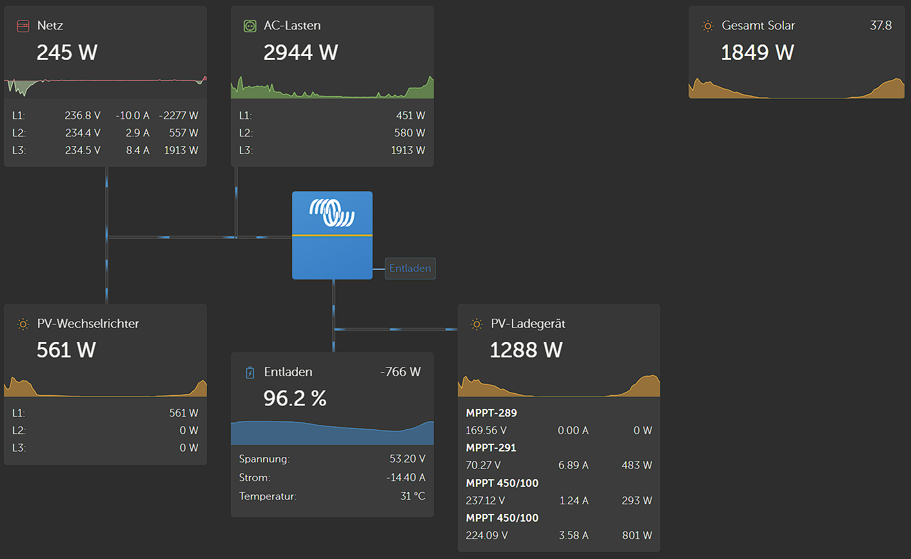
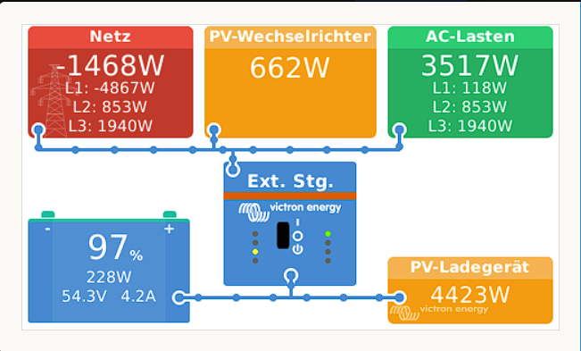
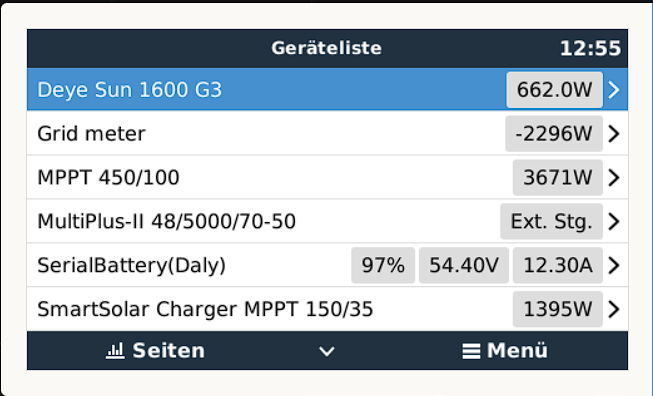
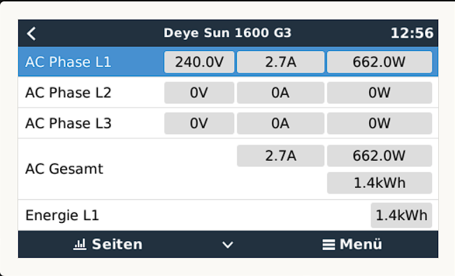

# dbus-deye-sun-g3-pvinverter
Integrate Deye Sun G3 Inverter into Victron Energies Venus OS

## Purpose
With the scripts in this repo it should be easy possible to install, uninstall, restart a service that connects the Deye Sun G3 Inverter to the VenusOS and GX devices from Victron.
This repo is based on the great work of @vikt0rm and others.

## Motivation
This repository is a modification of https://github.com/vikt0rm/dbus-shelly-1pm-pvinverter. 
My part in this is only the query of the data from the Deye inverter via modbus.

Why I don't use a Shelly: The Deye has the data in, for me, sufficient quality. You have to know, the inverter delivers data only every 5 minutes. If you need real-time data, then use the Shelly.


Special thanks to:
- @vikt0rm https://github.com/vikt0rm/dbus-shelly-1pm-pvinverter
- @schwatter https://github.com/schwatter/solarman_mqtt/blob/main/solarman_mqtt.py#L72C7-L93C13
- @kbialek https://github.com/kbialek/deye-inverter-mqtt/blob/bd3f4b749c80b9ca9f257cff88c6b878861e8650/deye_set_time_processor.py

And all the other deye hackers out there!

## How it works
### My setup
- 3-phase grid
- EMT540 as smart meter
- Deye inverter on phase 1
- Victron ESS on phase 1
- Venus OS on Raspberry PI 4 8GB - Firmware v3.00
  - Multiplus 2
  - Few Victron Solar Chargers
  - Battery

### Details / Process
As mentioned above the script is inspired by @fabian-lauer dbus-shelly-3em-smartmeter implementation.
So what is the script doing:
- Running as a service
- connecting to DBus of the Venus OS `com.victronenergy.pvinverter.http_{DeviceInstanceID_from_config}`
- After successful DBus connection Deye Sun G3 gets called via modbus and values are being published on DBus
- The device system time gets updated to allow daly production reset
- Serial is taken from the config file, auto detection is possible but not implemented
- Paths are added to the DBus with default value 0 - including some settings like name, etc
- After that a "loop" is started which pulls Deye Sun G3 data every x seconds
- The interval can be configured through the config file


### Pictures


 



## Install & Configuration
### Get the code
Just grap a copy of the main branche and copy them to a folder under `/data/` e.g. `/data/dbus-deye-sun-g3-pvinverter`.
After that call the install.sh script.

The following script should do everything for you:
```
wget https://github.com/s10l/dbus-deye-sun-g3-pvinverter/archive/refs/heads/main.zip
unzip main.zip -jd /data/dbus-deye-sun-g3-pvinverter/ && rm main.zip
cd /data/dbus-deye-sun-g3-pvinverter/
chmod a+x install.sh
./install.sh
```
⚠️ Check configuration after that - because service is already installed an running and with wrong connection data (host, username, pwd) you will spam the log-file

### Change config.ini
Within the project there is a file `/data/dbus-deye-sun-g3-pvinverter/config.ini` - just change the values - most important is the deviceinstance, custom name and phase under "DEFAULT" and host, username and password in section "ONPREMISE". More details below:

| Section  | Config vlaue | Explanation |
| ------------- | ------------- | ------------- |
| DEFAULT  | Address | IP or hostname of Deye Sun G3 Inverter |
| DEFAULT  | Port | The port on which SolarmanV5 is running |
| DEFAULT  | Serial | The serial number of the logger integrated in the inverter |
| DEFAULT  | FirmwareVersion | The firmware version which is reported, the firmware version is currently not read out, purely cosmetic |
| DEFAULT  | Phase | Valid values L1, L2 or L3: represents the phase where pv inverter is feeding in |
| DEFAULT  | SignOfLifeLog  | Time in minutes how often a status is added to the log-file `current.log` with log-level INFO |
| DEFAULT  | Deviceinstance | Unique ID identifying the Deye Sun G3 in Venus OS |
| DEFAULT  | CustomName | Name shown in Remote Console (e.g. name of pv inverter) |
| DEFAULT  | Position | Valid values 0, 1 or 2: represents where the inverter is connected (0=AC input 1; 1=AC output; 2=AC input 2) |
| DEFAULT  | UpdateInterval | The interval how often the data is read from the inverter in seconds. The inverter itself accumulates the values every 5 minutes. |

### Testing configuration
If you encounter any issue please test your settings in config.ini with:
```
cd /data/dbus-deye-sun-g3-pvinverter/
chmod a+x test-config.py
./test-config.py
```

```
The output should somehow look like this:
2023-10-09 15:40:31,225 root INFO config...
2023-10-09 15:40:31,226 root INFO xxx.xxx.xxx.xxx
2023-10-09 15:40:31,227 root INFO 8899
2023-10-09 15:40:31,227 root INFO xxxxxxxxxx
2023-10-09 15:40:47,171 pysolarmanv5.pysolarmanv5 DEBUG Socket setup completed... <socket.socket fd=4, family=AddressFamily.AF_INET, type=SocketKind.SOCK_STREAM, proto=6, laddr=('yyy.yyy.yyy.yyyy', 47644), raddr=('xxx.xxx.xxx.xxx', 8899)>
... some more debug messages ...
2023-10-09 15:40:47,925 root INFO data from deye:
2023-10-09 15:40:47,926 root INFO {'acEnergyForward': 1.8, 'acPower': 43.0, 'acCurrent': 0.1, 'acVoltage': 240.0, '_firmwareVersion': '1.53'}
```
There should be no error message but some JSON like output with data fetched from your inverter.

## Used documentation
- https://github.com/victronenergy/venus/wiki/dbus#pv-inverters   DBus paths for Victron namespace
- https://github.com/victronenergy/venus/wiki/dbus-api   DBus API from Victron
- https://www.victronenergy.com/live/ccgx:root_access   How to get root access on GX device/Venus OS
